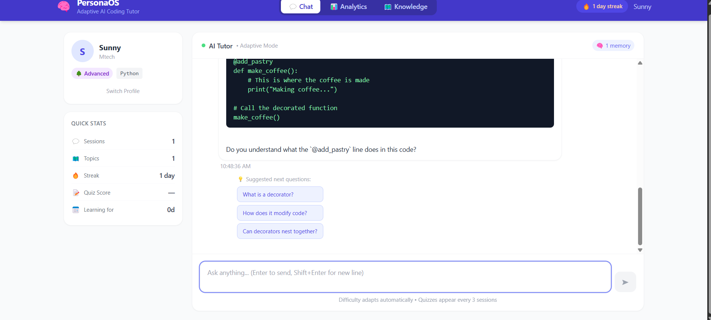
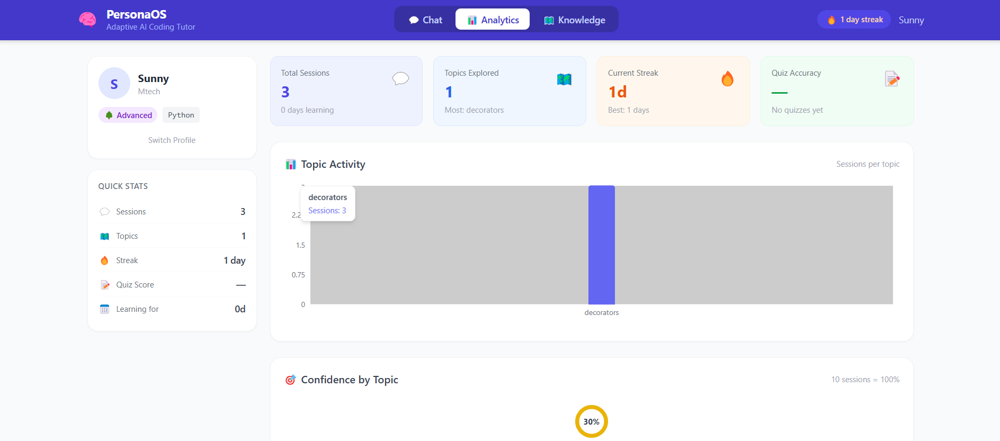
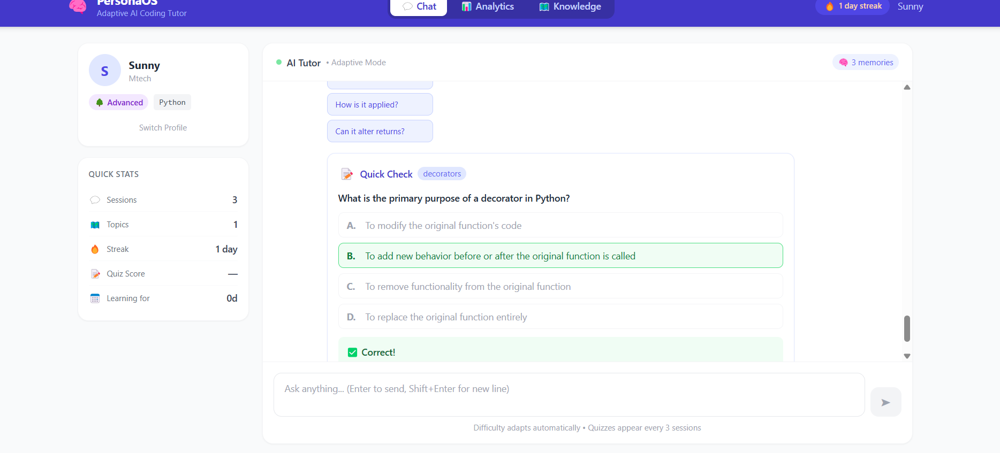

# PersonaOS

Adaptive AI Coding Tutor with:

- Long-Term Memory
- Semantic Retrieval
- Knowledge Graph
- Adaptive Difficulty
- Quiz Generation
- Spaced Repetition
- Learning Analytics

## Tech Stack

Frontend:
- React
- Tailwind CSS

Backend:
- FastAPI
- SQLite
- ChromaDB
- Sentence Transformers
- Groq API

## Dashboard

## Analytics

## Quiz System

## Knowledge Graph

